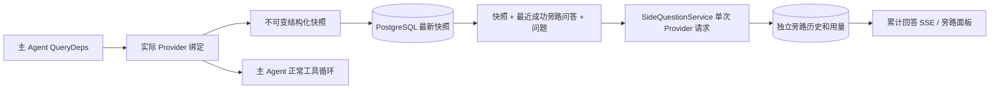

# ARTEX `/btw`

普通聊天、任务 MainAgent 和当前任务自己的 Worker 支持独立旁路提问。主输入框输入 `/btw 问题` 即可提交，空 `/btw` 或“旁路提问”按钮打开历史。桌面使用可调整宽度的侧栏，移动端使用 Drawer。

旁路回答根据提交时的 Agent 上下文快照生成，支持流式显示、追问、停止和清空。关闭面板、刷新页面或断开 SSE 都不会取消模型请求。停止只影响当前旁路；清空会取消旁路并删除旁路历史，同时保留主上下文快照。

## 实现边界

沿用 Go、norma v0.3.7、Next.js、现有 Markdown / ResizablePanel / Drawer / AlertDialog 组件；没有修改 norma 源码或为旁路添加依赖。Planner、继承自其他任务的 Worker、工具型子任务升级不在本次范围内。

- `capture.go` 只在 `Options.Deps.CallModel / CallModelSync` 标记主循环请求。Provider 装饰器位于具体模型内部、路由池外层选择之后，因此记录实际选中的模型；压缩和摘要请求不覆盖快照。
- 请求开始、完整模型回复、运行终态发布快照。正在生成的半段回复不发布；工具调用通过 norma 的 `MessagesForAPI` 保持配对，工具结果在下一次主模型请求或运行终态进入快照。流式中止保留上一个有效边界。
- 快照通过 JSON 深拷贝保留结构化消息、系统提示、工具定义及生成参数。模型推理不持有快照锁或数据库事务。
- `SideQuestionService` 调用具体 Provider；必要时先生成旁路摘要，最终回答仅在首次上下文超限且尚未输出文本/工具调用时允许缩减后重试一次。不创建 agent session，不接入工具执行器、主 transcript、活动流或任务图，也不经过任务模型切换链。回答保留工具定义是为兼容既有结构化工具上下文；摘要请求不提供工具。新返回的工具调用没有执行路径。
- 每个父会话一个运行请求，单个服务进程最多四个，单次超时 120 秒。旁路使用服务生命周期下的独立取消上下文。
- 旁路请求保留模型配置引用和非敏感身份摘要；请求时从现有配置取得凭据。配置被删除，或模型、协议、地址等身份字段变化，要求先运行主 Agent 更新快照。测试不会改变产品默认模型。

## 持久化和恢复

`db/schema.sql` 自动创建 `side_question_sessions` 和 `side_question_requests`。前者保存父资源、最新快照、运行编号、版本和清理版本；后者保存问题、累计回答、状态、模型、快照时间、用量、事件序号和分页序号。

父会话键使用 conversation ID，或 task ID + exploration ID + intent ID。Worker 不使用可复用的执行槽位命名。

快照按父会话合并写入，每 250 ms 刷新一次，数据库比较 `(run_id, version)` 防止旧版本覆盖。旁路提交前再次保存选定快照。成功保存后释放内存中的大快照；失败时保留待写版本。回答累计内容在流式事件到来时最多每 250 ms 写入一次，终态立即保存并在数据库错误时有限重试。

服务启动将遗留 `running` 请求标记为 `interrupted`，保留已落库的部分回答和用量，不自动重放请求。最近成功保存的上下文可直接用于下一次提问。旧会话没有快照时要求先运行主 Agent，不从 UI 活动记录重建上下文。

清空操作递增清理版本并删除请求；条件更新阻止迟到的回调重新写回。物理父资源删除依靠外键级联，Worker 逻辑删除在同一事务中删除旁路数据，并拒绝后续迟到快照。任务归档先阻止新请求、等待主流程停止、取消并等待旁路落库；归档格式为 v3，同时兼容不含旁路表的 v1/v2。

历史完整保存，按序号游标每页最多返回 20 条。模型请求最多回放最近 20 组成功问答原文，同时按 token 预算限制回放量；较旧问答维护独立滚动摘要。主上下文超预算时仅摘要旁路副本的旧部分，保留近期结构化工具调用与结果。摘要、准备进度与用量一起纳入旁路的并发、取消和 120 秒超时限制。详见 [上下文预算与开源参考](CONTEXT_BUDGET.md)。

## HTTP 契约

以下路径作为 `{parent}`，沿用现有认证及资源校验：

- `/api/conversations/{id}`
- `/api/tasks/{id}/chat`
- `/api/tasks/{id}/intents/{iid}`

| 请求 | 返回及行为 |
| --- | --- |
| `GET {parent}/side-questions?before={ordinal}` | `items` 按新到旧排列、独立 `current` 运行状态、`snapshot` 元信息、`next_cursor`；游标为 0 表示最新页 / 无下一页 |
| `POST {parent}/side-questions` | JSON `{ "question": "…", "client_request_id": "UUID" }`；新请求返回 202 及请求对象；相同 ID 和问题返回既有对象 200 |
| `DELETE {parent}/side-questions` | 取消并清空当前父会话的旁路问答 |
| `GET /api/side-questions/{requestID}/events` | `snapshot` SSE 事件，`id` 为递增序号，`data` 为完整累计请求对象；清空时发送 `cleared` |
| `POST /api/side-questions/{requestID}/cancel` | 显式取消；终态可从历史或 SSE 读取 |

问题上限 4000 字符。无快照、模型配置变化、同一父会话忙或幂等 ID 冲突返回 409；全局并发上限返回 429。每次 SSE 连接都先发送累计状态，不依赖客户端之前收到的文本片段。前端按请求 ID + 序号合并，并在切换父会话、清空时废弃旧回调。

## 验证与参考

自动化检查、实际模型使用及已知限制见 [VALIDATION.md](VALIDATION.md)。

独立请求参考 [Grok CLI side-question.ts（固定提交）](https://github.com/superagent-ai/grok-cli/blob/fb97af83f06dca873281d60168430f06c8de6324/src/utils/side-question.ts)，运行隔离参考 [OpenCode（固定提交）](https://github.com/anomalyco/opencode/tree/b3f1a96c6dd7adeb28b36dd11add1998fc84d67b)。ARTEX 的上下文使用 norma 的结构化消息，未采用从前端日志拼接文本的方式。
